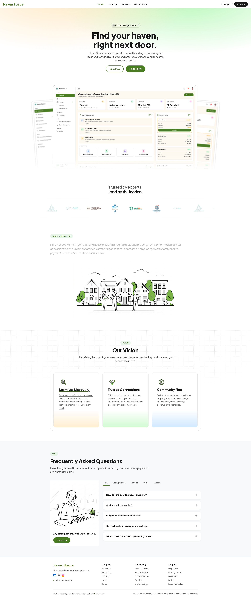

# Haven Space

<div align="center">


**A boarding house management platform connecting boarders and landlords in the Philippines.**

[](https://developer.mozilla.org/en-US/docs/Web/HTML)
[](https://developer.mozilla.org/en-US/docs/Web/CSS)
[](https://developer.mozilla.org/en-US/docs/Web/JavaScript)
[](https://www.php.net/)
[](https://getbootstrap.com/)
[](https://appwrite.io/)
[](https://www.mysql.com/)
[](https://bun.sh/)
[](https://prettier.io/)
[](https://eslint.org/)
[](LICENSE)

</div>

---

## Overview

Haven Space is a full-stack boarding house platform that streamlines the rental experience for both landlords and boarders. Landlords can list and manage properties, track payments, and communicate with tenants. Boarders can discover rooms, submit applications, and manage their stay — all in one place.

- **Frontend**: Vanilla HTML/CSS/JS served via Apache (`http://localhost`)
- **Backend**: PHP REST API running at `http://localhost:8000`
- **Cloud**: Deployed on [Appwrite](https://appwrite.io/) — `https://haven-space.appwrite.network`

---

## Features

### For Boarders

- Browse and search available rooms
- Submit rental applications
- Track application status
- Manage payments and view payment history
- Submit maintenance requests
- Communicate with landlords via messaging
- Submit leave requests

### For Landlords

- List and manage properties and rooms
- Review and approve/reject boarder applications
- Track rent payments and generate reports
- Post announcements to boarders
- Manage maintenance requests
- View analytics dashboard
- Calendar and scheduling tools

### For Admins

- Platform-wide user and property oversight
- Analytics and reporting

---

## Tech Stack

| Layer           | Technology                                   |
| --------------- | -------------------------------------------- |
| Frontend        | HTML5, CSS3, Vanilla JavaScript (ES Modules) |
| UI Framework    | Bootstrap                                    |
| Backend         | PHP 8+                                       |
| Database        | MySQL                                        |
| Cloud Platform  | Appwrite                                     |
| Package Manager | Bun                                          |
| Code Quality    | ESLint, Prettier, Husky, commitlint          |

---

## Project Structure

```
haven-space/
├── client/               # Static frontend (HTML, CSS, JS, assets)
│   ├── assets/           # Images, SVGs, icons
│   ├── components/       # Reusable HTML component templates
│   ├── css/              # Global and view-specific stylesheets
│   ├── js/               # ES module JavaScript
│   │   ├── components/   # Reusable UI component logic
│   │   ├── shared/       # Auth helpers, state, utilities
│   │   └── views/        # Page-level view initializers (by role)
│   └── views/            # HTML pages organized by role
│       ├── boarder/
│       ├── landlord/
│       ├── admin/
│       └── public/
├── functions/            # PHP backend
│   ├── api/              # Route table and legacy endpoints
│   ├── src/              # PSR-4 modules (Controllers/Services/Repositories)
│   ├── config/           # Appwrite and environment config
│   └── database/         # SQL migrations and seeds
├── scripts/              # Build, DB setup, and utility scripts
└── docs/                 # Documentation and manuals
```

---

## Getting Started

### Prerequisites

- [Bun](https://bun.sh/) — JS package manager and task runner
- [PHP 8+](https://www.php.net/) with Composer
- [MySQL](https://www.mysql.com/) (via XAMPP or standalone)
- [Apache](https://httpd.apache.org/) (via XAMPP) for serving the frontend

### Installation

```bash
# 1. Clone the repository
git clone https://github.com/your-org/haven-space.git
cd haven-space

# 2. Install JS dev dependencies
bun install

# 3. Install PHP backend dependencies
composer install --working-dir functions

# 4. Install Appwrite function dependencies
composer install --working-dir functions/api

# 5. Set up the database
bun run db:setup
```

### Running Locally

Start Apache and MySQL via XAMPP (or your preferred stack), then:

```bash
# The PHP API server should already be running at http://localhost:8000
# Frontend is served from http://localhost via Apache
```

---

## Available Scripts

| Command                                 | Description                                 |
| --------------------------------------- | ------------------------------------------- |
| `bun run build`                         | Build deployable static frontend to `dist/` |
| `bun run lint`                          | Lint frontend JavaScript                    |
| `bun run lint:fix`                      | Auto-fix lint issues                        |
| `bun run format`                        | Format all files with Prettier              |
| `bun run format:check`                  | Check formatting without writing            |
| `bun run db:setup`                      | Run database migrations                     |
| `bun run db:reset`                      | Reset the database                          |
| `composer test --working-dir functions` | Run backend tests                           |

---

## Deployment

The platform is deployed on **Appwrite Cloud**.

- Production URL: [https://haven-space.appwrite.network](https://haven-space.appwrite.network)
- Deploy Appwrite function: `appwrite push function api-function`

---

## Contributing

1. Fork the repository
2. Create a feature branch: `git checkout -b feat/your-feature`
3. Commit using [Conventional Commits](https://www.conventionalcommits.org/): `git commit -m "feat: add room search filters"`
4. Push and open a pull request

Pre-PR checks:

```bash
bun run lint && bun run format:check && bun run build
```

---

## License

This project is licensed under the [MIT License](LICENSE).

---

## Documentation

- [Setup Manual](docs/MANUAL.md) — step-by-step local setup guide
- [Commit Guidelines](docs/COMMIT_GUIDELINES.md)
- [Contributing](.github/CONTRIBUTING.md)

---

<div align="center">
  Made with ❤️ by the Haven Space Team
</div>

---

## Preview


